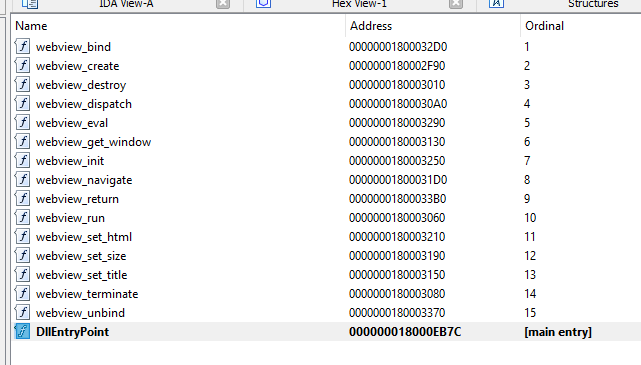

# webview-static
https://github.com/webview/webview static

```
git clone --single-branch --depth 1 https://github.com/webview/webview.git
cd webview
sed -i "s/WebView2Loader.dll.lib/WebView2LoaderStatic.lib/g" script/build.bat
script/build.bat
```

